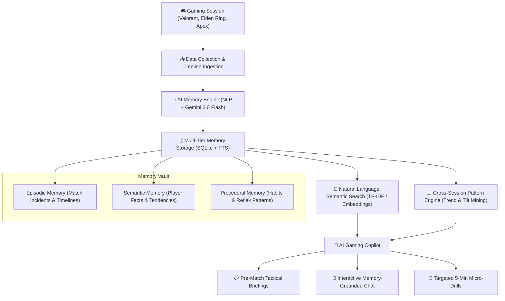

# 🧠 Gaming Second Brain — AI Gaming Copilot Intelligence & Memory Layer

> **"A player's memory fades. Their habits don't. The Gaming Second Brain remembers every clutch, misplay, and tilt spiral so you never repeat the same mistake twice."**

[](https://fastapi.tiangolo.com)
[](https://react.dev)
[](https://ai.google.dev)
[]()

---

## 🎯 Core Product Idea

The **Gaming Second Brain** is the dedicated intelligence and memory layer for an AI Gaming Copilot. Rather than a bloated gaming platform, it focuses strictly on the closed-loop player journey:

```
[ 1. PLAY ] ──> [ 2. UNDERSTAND ] ──> [ 3. REMEMBER ] ──> [ 4. LEARN ] ──> [ 5. IMPROVE ]
```

The system:
1. **Captures** session logs and real-time match events.
2. **Understands** the tactical and psychological root causes of deaths, clutches, and throws.
3. **Remembers** them across three distinct cognitive memory tiers: **Episodic**, **Semantic**, and **Procedural**.
4. **Learns** cross-session patterns (e.g. *The 11:00 PM Fatigue Cliff*, *Defensive Chokepoint Dry-Peeking*, *Boss Low-HP Greed*).
5. **Improves** the player with pre-match tactical briefings, conversational memory retrieval, and personalized micro-drills.

---

## 🏛️ Architecture Flow



---

## 📌 Problem & Solution

> An intelligent gaming companion that understands active gaming sessions, remembers past gameplay insights, analyzes behavioral patterns, and helps users seamlessly transition from gaming to productive tasks.

---

## 📌 Problem

Modern gamers face several acute cognitive and lifestyle challenges:

1. **Cognitive Fatigue & Time Blindness**: Deep immersion in modern gaming often leads to lost time awareness, physical strain, and burnout without real-time wellness or pacing feedback.
2. **Context Loss & Fragmented Memory**: Strategic insights, optimal builds, match outcomes, in-game notes, and lessons learned are quickly forgotten or scattered across notebooks, Discord channels, and screenshots. Gamers lack a unified, queryable personal knowledge base ("Second Brain").
3. **Severe Friction in Productivity Transitions**: Shifting directly from high-dopamine, fast-paced gaming states into work, study, or daily responsibilities causes acute executive dysfunction, procrastination, and post-gaming inertia.
4. **Lack of Behavioral Pattern Awareness**: Players rarely have visibility into how session length, game genre, tilt/frustration triggers, or late-night gaming affect their sleep, mood, and daily productivity.

---

## 💡 Solution

**AI Gaming Copilot + Gaming Second Brain** addresses these challenges through a dual-engine architecture:

- **AI Gaming Copilot**: A real-time companion that monitors active session context, tracks session duration and intensity, provides gentle in-session wellness nudges, and orchestrates smooth, guided wind-down rituals to transition players from gaming to productive tasks.
- **Gaming Second Brain**: A persistent, semantic memory store that indexes session highlights, tactics, match outcomes, and personal notes. Using natural language memory retrieval, players can recall past strategies, analyze play patterns, and review historical insights effortlessly.

Together, the system preserves the joy and achievements of gaming while protecting player well-being and daily productivity.

---

## 🚀 Main Features

### 1. Real-Time Session Monitoring & Context Tracking
- Tracks active game sessions, duration, and session intensity.
- Captures key session milestones, match outcomes, and user-noted events.
- Maintains contextual awareness of active player state.

### 2. Gaming Second Brain & Natural-Language Memory Retrieval
- Semantic indexing of gaming notes, tactical decisions, build loadouts, and session logs.
- Conversational search allowing players to ask questions like: *"What strategy worked best against Boss X last week?"* or *"Summarize my last 3 sessions in Valorant."*
- Persistent player profile maintaining historical trends, favorite games, and playstyles.

### 3. Smart Transition Protocols (Gaming → Productivity)
- **Guided Wind-Down Ritual**: Step-by-step cooldowns that lower cognitive stimulation before stepping away from the screen.
- **Post-Session Reflection**: Quick capture of thoughts, match takeaways, and mood checks.
- **Productivity Bridge**: Automatically surfaces pending tasks, to-dos, or calendar events with a gentle ramp-up (e.g., micro-tasks, 5-minute warm-up sessions).

### 4. Pattern & Behavioral Analytics
- Detects patterns related to tilt, session fatigue, and optimal play windows.
- Correlates gaming habits with user-reported energy and task completion.
- Delivers actionable recommendations for healthier gaming routines.

### 5. Unified Dashboard & Extensible API
- Clean, responsive gamer dashboard displaying active session stats, memory logs, analytics, and productivity task queues.
- Decoupled API architecture allowing future integrations with game telemetry, Discord bots, and productivity platforms (e.g., Notion, Todoist, Google Calendar).

---

## 👥 Team Responsibilities

### Primary Contributor (Full-Stack & Systems)
- **Frontend**:
  - User interface design and responsive layout for the web dashboard.
  - Active session view, memory timeline, and transition ritual components.
  - State management and real-time UI updates.
- **Backend**:
  - Core API server architecture (REST & WebSocket endpoints).
  - Business logic orchestration, session lifecycle management, and transition triggers.
  - Middleware, request validation, error handling, and security foundations.
- **Database**:
  - Relational/document schema design for user profiles, game sessions, notes, and productivity tasks.
  - Efficient indexing, data models, and migration strategy.
- **API Integration**:
  - Integration contracts connecting Frontend, Backend, and AI services.
  - External service integrations (game telemetry hooks, webhooks, productivity tools).

### Teammate (AI & Intelligence)
- **AI Core**:
  - LLM pipeline architecture, prompt engineering, and context window orchestration.
  - Model selection, inference optimization, and structured output parsing.
- **Gaming Second Brain Intelligence**:
  - Document chunking, vector embeddings, and semantic memory indexing.
  - Knowledge graph / episodic memory representation of gaming sessions.
- **AI Analysis**:
  - Pattern recognition algorithms for fatigue, tilt, and play trends.
  - Transition recommendation engine matching player state to appropriate cooldown routines.
- **Natural-Language Memory Retrieval**:
  - Semantic search and vector database queries (RAG pipeline).
  - Conversational memory agent for natural language querying of past gaming sessions.

---

## 🏗 Planned Architecture

### High-Level Architecture Diagram

```
+-----------------------------------------------------------------------+
|                             USER CLIENT                               |
|                  Frontend (Web Dashboard / Overlay)                   |
|  - Active Session Tracker   - Transition Rituals   - Memory Explorer  |
+-----------------------------------+-----------------------------------+
                                    |
                           HTTP / WebSockets
                                    |
                                    v
+-----------------------------------------------------------------------+
|                            BACKEND SERVER                             |
|                           (Core API Engine)                           |
|  - Session Manager          - API Router          - Task Bridge       |
|  - Auth & User State        - Event Dispatcher    - External Connectors|
+-------------------+-----------------------------------+---------------+
                    |                                   |
         CRUD / Data Persistence               IPC / Internal API
                    |                                   |
                    v                                   v
+-----------------------------------+   +-------------------------------+
|             DATABASE              |   |           AI ENGINE           |
|         (Data Persistence)        |   |    (Gaming Second Brain)      |
|  - User Profiles & Preferences    |   |  - Embedding Pipeline         |
|  - Game Session Logs & Stats      |   |  - Vector Store / RAG Engine  |
|  - Notes, Tags & Reflections      |   |  - Pattern Analysis Engine    |
|  - Productivity Task Queues       |   |  - Natural Language Retrieval |
+-----------------------------------+   +-------------------------------+
```

### Component Breakdown

1. **`frontend/`**:
   - Modern web interface providing the dashboard for active session monitoring, memory queries, analytics visualization, and guided transition routines.
2. **`backend/`**:
   - Central application server managing session state, database interactions, external integrations, and orchestrating requests between the client and AI services.
3. **`ai/`**:
   - Intelligence microservice/module containing the RAG pipeline, vector embeddings, pattern analysis logic, and LLM reasoning for memory synthesis and transition coaching.

---

## 📂 Project Structure

```
ai-gaming-copilot/
├── frontend/             # Frontend web application (UI, dashboard, session view)
│   └── .gitkeep
├── backend/              # Core API server (business logic, endpoints, DB layer)
│   └── .gitkeep
├── ai/                   # AI & Second Brain intelligence (embeddings, RAG, analysis)
│   └── .gitkeep
├── .gitignore            # Git ignore configuration
└── README.md             # Project documentation and architectural overview
```

---

## 🚀 6 Core Product Modules

| # | Module | Description |
|---|--------|-------------|
| **1** | **Session Data** | Ingests match metadata, KDA/ACS telemetry, timeline events, and player voice/text reflections. |
| **2** | **Memory Storage** | SQLite-backed cognitive vault split into **Episodic** (matches), **Semantic** (player traits), and **Procedural** (habits). |
| **3** | **AI Memory Processing** | Extracts root causes, misplays vs clutch moments, tilt indices, and generates automatic tags (`#Haven`, `#DryPeeking`, `#PanicRoll`). |
| **4** | **Natural Language Search** | Free-form semantic search allowing players to ask questions like *"Why do I keep losing on Haven?"* and get synthesized answers citing exact matches. |
| **5** | **Cross-Session Analysis** | Mines statistical patterns across sessions: detects tilt spirals, circadian fatigue cliffs, and weapon/map win-rate drops. |
| **6** | **Personalized Recommendations & Copilot** | Generates pre-match briefings for upcoming maps/bosses, micro-drills, and provides an interactive Copilot chat. |

---

## ⚡ Quickstart Guide

### 1. Launch the Server
The application is already running in your environment at:
```bash
python run.py
```
Open your browser to: **[http://127.0.0.1:8000](http://127.0.0.1:8000)**

### 2. Dual Engine Support (Zero Config or Gemini Powered)
- **Built-in Cognitive AI Engine (Default):** Runs 100% locally and offline using rule-based NLP, sentiment analysis, event categorization, and TF-IDF semantic search.
- **Google Gemini 2.0 Flash:** Optional hot-switch. Click the **Settings** gear icon in the UI or set `GEMINI_API_KEY` in your environment to unlock direct cloud LLM reasoning.

### 3. Run Automated Tests
```bash
python -m unittest tests/test_memory_engine.py
```

---

## 🎮 Hackathon Demo Walkthrough

1. **Top Journey Bar:** Click between `1. PLAY` ➔ `2. UNDERSTAND` ➔ `3. REMEMBER` ➔ `4. LEARN` ➔ `5. IMPROVE` to follow the product loop.
2. **Live Simulator (Play & Ingest):**
   - Click the **"Live Simulator"** tab.
   - Select *"Valorant: Haven Overtime Choke"* or *"Elden Ring: Malenia Waterfowl Trial"*.
   - Click **"Run Live Simulation"** to watch the match stream live events and instantly synthesize new memories into the brain!
3. **Memory Vault (Remember):**
   - Filter by *Episodic*, *Semantic*, or *Procedural* to see how the player's experiences are organized.
4. **Natural Language Search (Query):**
   - Try the 1-click prompt chips:
     - *"Why do I keep losing on Haven C site?"*
     - *"When do I tilt the most?"*
     - *"How do I stop panic rolling against Margit?"*
   - Observe how the Second Brain synthesizes a direct answer citing round numbers and gives a **Golden Rule Takeaway**.
5. **Cross-Session Patterns (Learn):**
   - Inspect the **11:00 PM Fatigue Cliff** pattern (win rate dropping from 68% to 15% past 11 PM).
   - View the Tilt vs Outcome bar chart showing how frustration leads to round throws.
6. **AI Copilot & Tactical Briefing (Improve):**
   - Select *Valorant* and *Haven* in the Tactical Briefing generator and click **"Generate Tactical Briefing"**.
   - Chat directly with the Copilot: ask *"What is my biggest bad habit?"* and get advice backed by your memory vault.

---

## 📁 Repository Structure

```
iqoo/
├── app/
│   ├── config.py              # Application settings & Gemini configuration
│   ├── database.py            # SQLite schema, migrations, and CRUD helpers
│   ├── models.py              # Pydantic schemas for sessions, memories, and queries
│   ├── memory_engine.py       # Core AI Memory Engine (Episodic, Semantic, Procedural)
│   ├── semantic_search.py     # Hybrid semantic retrieval & answer synthesizer
│   ├── pattern_analyzer.py    # Cross-session pattern miner & tilt telemetry
│   ├── copilot.py             # Pre-match briefing generator & Copilot chat
│   ├── seed_data.py           # Authentic gaming sessions (Valorant, Elden Ring, Apex)
│   └── main.py                # FastAPI endpoints & static routing
├── static/
│   ├── index.html             # Cyber Esports HUD Dashboard
│   ├── css/
│   │   └── style.css          # Glassmorphism, animations, and neon styling
│   └── js/
│       ├── app.js             # State management, simulation, and event bus
│       └── charts.js          # Chart.js telemetry visualizations
├── tests/
│   └── test_memory_engine.py  # 10 comprehensive unit tests
├── run.py                     # Uvicorn server launcher
└── README.md                  # Hackathon pitch & technical documentation
```

---

## 🚦 Roadmap & Implementation Plan

- [x] **Step 1: Project Foundation & Architecture**
- [x] **Step 2: Core Data Models & Telemetry**
- [x] **Step 3: Backend & Database Implementation**
- [x] **Step 4: AI Second Brain & Retrieval Integration**
- [x] **Step 5: Frontend Dashboard & Mobile Responsive UI**
- [x] **Step 6: End-to-End Verification & Real-Time Copilot Integration**
